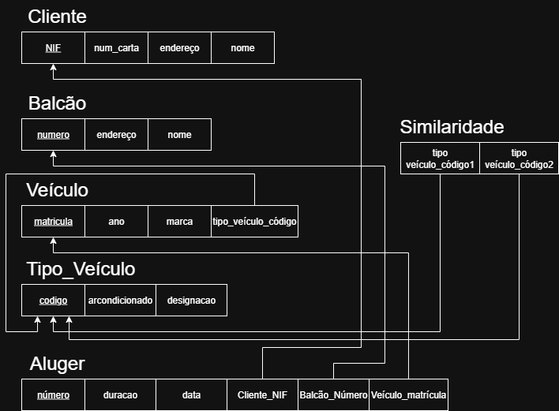
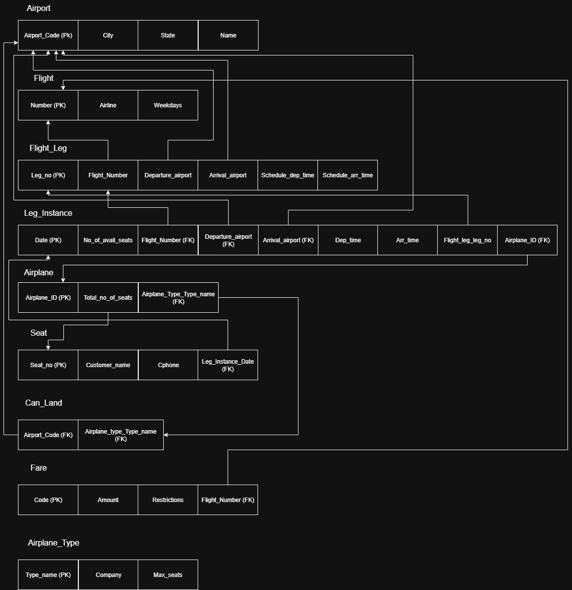
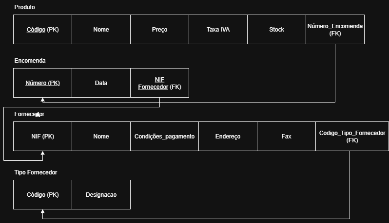
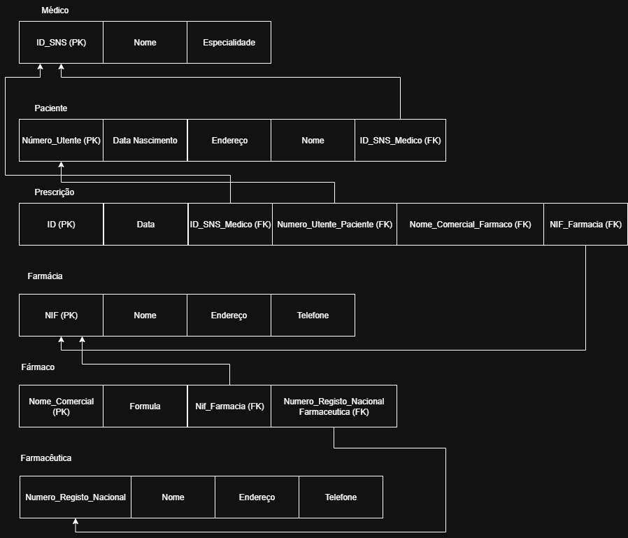
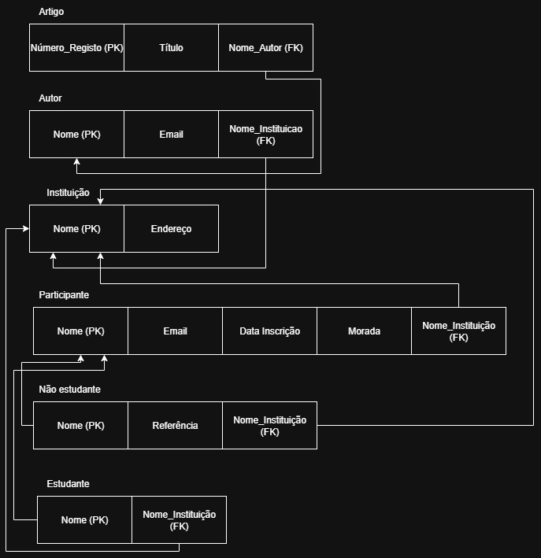

# BD: Guião 3


## ​Problema 3.1
 
### *a)*

```
... Write here your answer ...
Cliente - NIF, num_carta, endereço, nome
Aluguer - data, número, duração
Balcao - nome, número, endereço
Veículo - marca, matrícula, ano
Tipo_Veiculo - designação, arcondicionado, codigo
Ligeiro - numlugares, portas, combustivel
Pesado - peso, passageiros
Similaridade - codigo_A, codigo_B


```


### *b)* 

```
... Write here your answer ...

Chaves Primárias:
    Cliente:
        -NIF.
    Aluguer:
        -número.
    Balcão:
        -número.
    Veículo:
        -matricula.
    Tipo_Veículo:
        -codigo.

Chaves Candidatas:
    Cliente:
        -NIF;
        -num_carta.
    Aluger:
        -número.
    Balcao:
        -número.
    Veículo:
        -matrícula.
    Tipo_veículo:
        -código

Chaves Estrangeiras:
    Veículo:
        -Vipo_Veículo.
    Aluguer:
        -NIF;
        -Balcão_Número;
        -matrícula.
    Similaridade:
        -TipoVeículo_Código1; 
        -TipoVeículo_Código2.
```


### *c)* 




## ​Problema 3.2

### *a)*

```
... Write here your answer ...
Airport - Airport_code, City, State, Name

Airplane_Type - Company, Type_name, Max_seats

Airplane - Airplane_id, Total_no_of_seats, Airplane_Type

Flight_Leg - Leg_no, flight_number, Departure_airport, Arrival_airport, Scheduled_dep_time, Scheduled_arr_time 

Flight - Number, Airline, Weekdays

Leg_Instance- No_of_avail_seats, Date, flight_number, Departure_airport, Arrival_airport, Dep_time, Arr_time, flight_leg_leg_no

Fare - Restrictions, Amount, Code, flight_number

Seat - Seat_no, Customer_name, Cphone, Leg_instance_Date

Can_Land - Airplane_type_Type_name, Airport_Airport_code


```


### *b)* 

```
... Write here your answer ...


Airport:
    Chaves Primárias:
        -Airport_code.
    Chaves Candidatas:
        -Airport_code.
Flight:
    Chaves Primárias:
        -Number.
    Chaves Candidatas:
        -Number.
Flight_Leg:
    Chaves Primárias:
        -Leg_no.
        -Flight_Number
    Chaves Candidatas:
        -Leg_no.
    Chaves Estrangeiras:
        -Airport_Airport_Code;
        -Flight_Number.
Leg_Instance:
    Chaves Primárias:
        -Date
    Chaves Estrangeiras:
        -Airplane_Airplane_ID;
        -Flight_Leg_Leg_no;
        -Airport_Airport_Code;
        -Flight_Number.
Airplane:
    Chaves Primárias:
        -Airplane_ID.
    Chaves Candidatas:
        -Airplane_ID.
    Chaves Estrangeiras:
        -Airplane_Type_Type_name
Seat:
    Chaves Primárias:
        -Seat_no.
    Chaves Candidatas:
        -Seat_no.
    Chaves Estrangeiras:
        -LegInstance_Numeber; LegInstance_LegNo.
Can_Land:
    Chaves Primárias:
        -{ Airport_Code, Airplane_Type_Typename }.
    Chaves Estrangeiras:
        -Airport_Code;
        -Airplane_Type_Type_Name.
Fare:
    Chaves Primárias:
        -Code
    Chaves Candidatas:
        -Code
    Chaves Estrangeiras:
        -Flight_Number;
        -Flight_Leg_Leg_no.
AirPlane_Type:
    Chaves Primárias:
        -Type_Name
    Chaves Candidatas:
        -Type_Name
```


### *c)* 




## ​Problema 3.3


### *a)* 2.1



### *b)* 2.2



### *c)* 2.3



### *d)* 2.4

